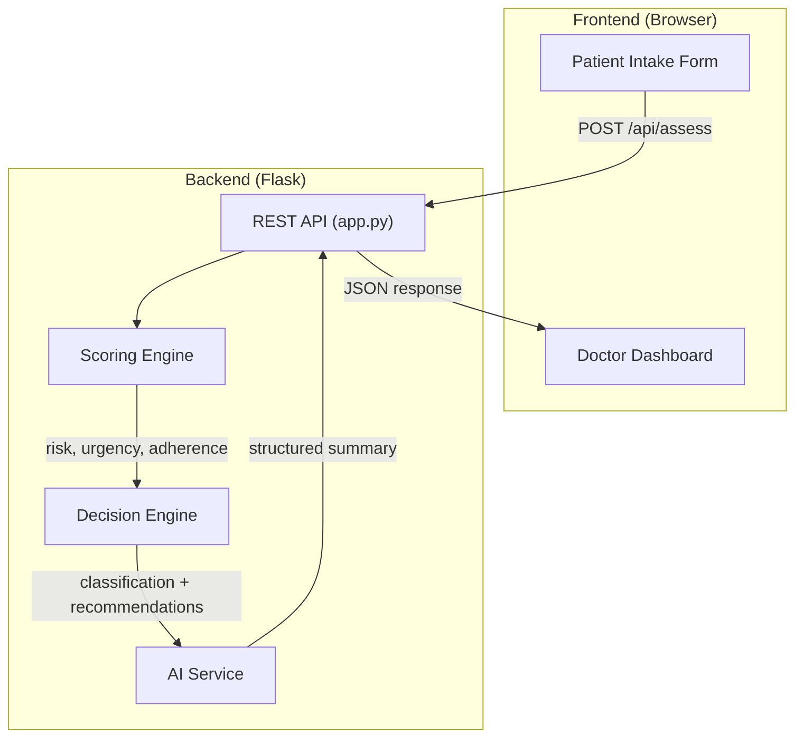

# Healthcare OS — Architecture

## System Overview

The Healthcare Operating System is a full-stack web application providing real-time clinical decision intelligence. It computes patient risk scores, classifies urgency, and generates structured summaries for both doctors and patients.

## Architecture Diagram

## Component Responsibilities

| Component | File | Purpose |
|-----------|------|---------|
| **REST API** | `app.py` | HTTP server, request validation, CORS, static file serving |
| **Scoring Engine** | `scoring_engine.py` | Computes Risk, Urgency, and Adherence scores (0–1) |
| **Decision Engine** | `decision_engine.py` | Classifies patient (CRITICAL / LOW ADHERENCE / NORMAL), generates recommendations |
| **AI Service** | `ai_service.py` | Produces Doctor Summary, Patient Instructions, Workflow Actions |
| **Frontend** | `index.html`, `index.css`, `app.js` | Patient intake form + Doctor dashboard SPA |

## Data Flow

1. Patient submits symptoms, vitals, and medical history via the web form
2. `app.py` validates input and forwards to Scoring Engine
3. Scoring Engine computes three scores from patient data
4. Decision Engine classifies the patient and determines recommendations
5. AI Service generates structured text summaries using templates
6. API returns the complete assessment as JSON
7. Frontend renders the Doctor Dashboard with gauges, summaries, and actions

## Technology Stack

- **Backend**: Python 3, Flask, flask-cors
- **Frontend**: Vanilla HTML5, CSS3, JavaScript (ES6+)
- **Fonts**: Google Fonts (Inter)
- **No external AI API dependencies** — runs fully offline
