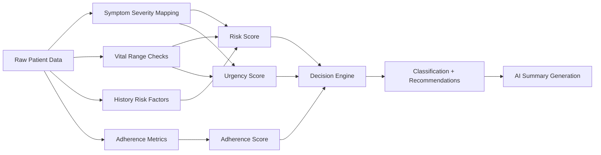
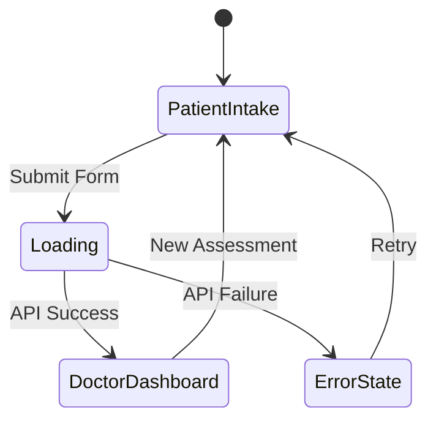

# Healthcare OS — System Design

## 1. Data Model

### Patient Input Schema
```json
{
  "name": "string",
  "age": "integer",
  "gender": "string",
  "symptoms": "string (comma-separated)",
  "symptom_duration": "string",
  "medical_history": "string (comma-separated conditions)",
  "current_medications": "string",
  "vitals": {
    "heart_rate": "integer (bpm)",
    "blood_pressure_systolic": "integer (mmHg)",
    "blood_pressure_diastolic": "integer (mmHg)",
    "temperature": "float (°F)",
    "spo2": "integer (%)"
  },
  "adherence_info": {
    "missed_medications_per_week": "integer",
    "missed_appointments_last_6months": "integer",
    "follows_diet_plan": "boolean",
    "exercises_regularly": "boolean"
  }
}
```

### Assessment Output Schema
```json
{
  "patient_context": { "name", "age", "gender", "symptoms_list", "vitals_summary" },
  "scores": { "risk": 0.0-1.0, "urgency": 0.0-1.0, "adherence": 0.0-1.0 },
  "classification": "CRITICAL | LOW_ADHERENCE | NORMAL",
  "doctor_summary": { "key_issues": [], "risk_level": "", "recommended_actions": [] },
  "patient_instructions": { "steps": [], "warnings": [] },
  "workflow_actions": { "appointments": [], "alerts": [], "follow_ups": [] }
}
```

## 2. Scoring Pipeline



## 3. Decision Logic

| Condition | Classification | Action |
|-----------|---------------|--------|
| Risk > 0.8 AND Urgency > 0.7 | **CRITICAL** | Immediate escalation, emergency alert |
| Adherence < 0.4 | **LOW ADHERENCE** | Engagement strategy, counseling referral |
| Otherwise | **NORMAL** | Standard care, routine follow-up |

## 4. Frontend State Machine



## 5. Security & Privacy Notes

- All data stays in-browser and on the local server (no external API calls)
- No patient data is persisted to disk — session-only
- CORS restricted to same-origin in production
